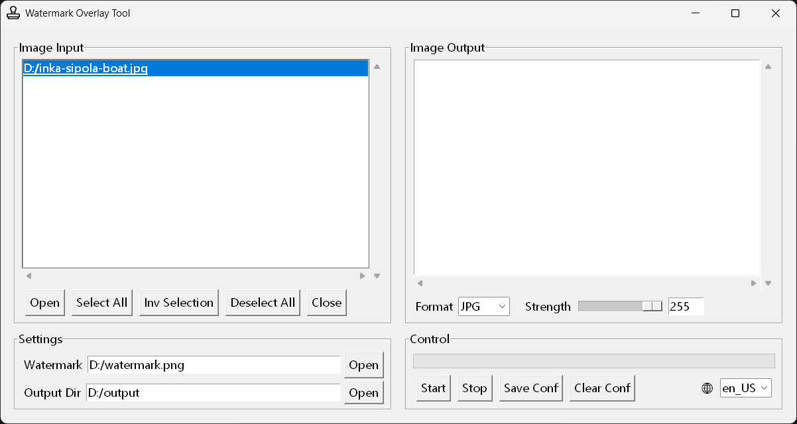
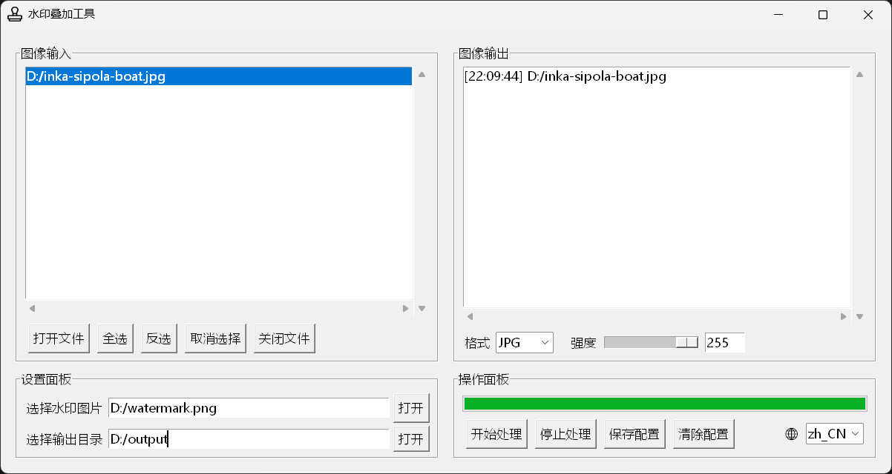

# Easy Watermark Tool / 简单水印工具

A Python-based batch image watermarking tool with support for customizable watermark effects. GUI built with Tkinter, executable file packaged with PyInstaller.

一个基于 Python 的图片水印批处理工具，支持自定义水印叠加效果。GUI通过tkinter编写，exe程序通过PyInstaller打包。

[Jump to Chinese Section / 跳转到中文部分](#chinese-section)

## ✨ Features

- 🖼️ Batch processing of image watermarks
- 🎨 Customizable watermark opacity
- 🔄 Automatic tiling for small-sized watermarks
- 💾 Support for JPG/PNG output formats
- 🌍 Bilingual interface (English/Chinese)
- ⚙️ Automatic saving of configuration settings
- 🖥️ User-friendly graphical interface
- 📋 Quick copy of file paths

## 🚀 Quick Start

### Download EXE File (Windows Platform)

Just click and run!

### Run with Python (Multi-Platform)

Requirements:
- Python 3.6+
- PIL (Pillow)
- NumPy
- tkinter

## 📖 Usage Instructions

1. Select a watermark image (PNG format only).
2. Select images to process (PNG/JPG formats supported).
3. Set watermark intensity (0–255).
4. Choose output format (JPG/PNG).
5. Select output directory.
6. Click "Start Processing."

## 🛠️ Feature Details

### Watermark Processing
- Recommended: Use white text with a transparent background for watermarks.
- Automatically adapts to different image sizes, with small watermarks tiled to cover the image.

### Batch Processing
- Supports multiple file selection.
- Real-time processing progress display.
- Processing can be interrupted at any time.

### Configuration Management
- Save or clear configuration settings.
- Configuration file stored in the same directory.

### Notes
- Output directory will be created automatically if it doesn’t exist.
- Language changes require restarting the program to take effect.

---

## ✨ 特性

- 🖼️ 支持批量处理图片水印
- 🎨 自定义水印透明度
- 🔄 自动平铺小尺寸水印
- 💾 支持 JPG/PNG 输出格式
- 🌍 支持中英文界面
- ⚙️ 自动保存配置信息
- 🖥️ 友好的图形界面
- 📋 支持文件路径快速复制

## 🚀 快速开始

### 下载EXE文件（适合Windows平台）

点击运行即可

### 使用Python运行（适合多种平台）

运行环境：
- Python 3.6+
- PIL (Pillow)
- NumPy
- tkinter

## 📖 使用说明

1. 选择水印图片（仅支持 PNG 格式）
2. 选择需要处理的图片（支持 PNG/JPG 格式）
3. 设置水印强度（0-255）
4. 选择输出格式（JPG/PNG）
5. 选择输出目录
6. 点击"开始处理"

## 🛠️ 功能说明

### 水印处理
- 建议使用透明底的白色文字作为水印
- 自动适配不同尺寸图片，小水印自动平铺铺满

### 批量处理
- 支持多文件选择
- 实时处理进度显示
- 可随时中断处理

### 配置管理
- 可以保存/清除配置信息
- 配置文件位于同一目录下

### 注意事项
- 输出目录如不存在会自动创建
- 语言切换需要重启程序生效